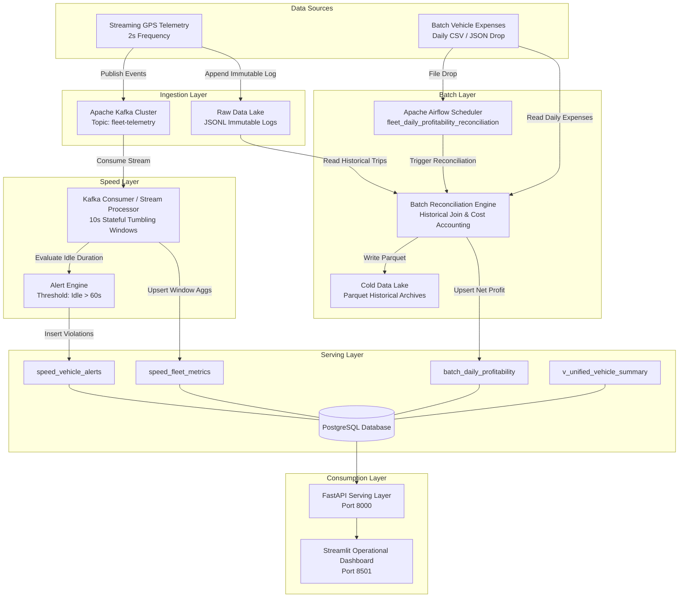

# Technical Report: End-to-End Lambda Architecture Data Platform for Ride-Hailing Fleet Operations

**Module:** EC 8203 Applied Big Data Engineering  
**Assessment:** Mini Project Assessment (25% Total Grade)  
**Selected Use Case:** Use Case 1: Ride-Hailing Fleet Operations  
**Architecture:** Lambda Architecture (Speed, Batch, and Serving Layers)  
**Authors:** Big Data Engineering Group  

---

## Table of Contents
1. [Executive Summary & Problem Statement](#1-executive-summary--problem-statement)
2. [Use Case Analysis & Business Requirements](#2-use-case-analysis--business-requirements)
3. [Architecture Decision: Lambda vs. Kappa Evaluation](#3-architecture-decision-lambda-vs-kappa-evaluation)
4. [Designed End-to-End Architecture & Data Flow](#4-designed-end-to-end-architecture--data-flow)
5. [Technology Stack Selection & Layer Justification](#5-technology-stack-selection--layer-justification)
6. [Simulated Clock & Data Ingestion Implementation](#6-simulated-clock--data-ingestion-implementation)
7. [Processing Layer: Stream & Batch Transformations](#7-processing-layer-stream--batch-transformations)
8. [Storage, Serving Layer & Unified Views](#8-storage-serving-layer--unified-views)
9. [Observability, Alerting & Health Monitoring](#9-observability-alerting--health-monitoring)
10. [Demonstration Results & Operational Analytics](#10-demonstration-results--operational-analytics)
11. [Limitations, Trade-Offs & Production Scale Roadmap](#11-limitations-trade-offs--production-scale-roadmap)
12. [References](#12-references)

---

## 1. Executive Summary & Problem Statement

Modern ride-hailing operators manage fleets comprising thousands of distributed vehicles operating concurrently across multiple municipal zones. To sustain operational efficiency and financial viability, fleet managers require dual analytical capabilities:
1. **Low-Latency Operational Visibility:** Real-time monitoring of fleet state (active trips, vehicle locations, zone congestions, and idle ratios) to rebalance driver distribution and reduce client dispatch waiting times.
2. **Comprehensive Financial Reconciliation:** Consolidated accounting that reconciles live gross fare yields with delayed, periodic operational expenditures (fuel invoices, garage repairs, scheduled maintenance, and tire replacements).

Without an integrated data platform, fleet operators suffer from operational blindspots—such as vehicles idling undetected in low-demand zones—and financial leakage, where high fuel consumption and unexpected maintenance render high-grossing vehicles net-negative.

This project architects, implements, and evaluates an end-to-end **Lambda Architecture** data pipeline that ingests continuous telemetry streams alongside daily garage batch extracts. The platform produces real-time zone utilization metrics, automated threshold-based idle alerts, and an automated daily per-vehicle profitability report.

---

## 2. Use Case Analysis & Business Requirements

### 2.1 Domain Context (Ride-Hailing Fleet Operations)
The operational model centers on two distinct data generation cadences:
- **Telemetry Event Stream:** Emitted every 2 seconds per vehicle, containing location coordinates (`lat`, `lon`), current velocity (`speed`), operational status (`idle`, `enroute`, `on_trip`), accumulated trip fare, and timestamp.
- **Daily Batch Expense Feed:** Delivered periodically (once per simulated day) from external garages and fuel providers, containing verified fuel costs, maintenance/repair costs, total distance covered, and garage service flags.

### 2.2 Core Business Questions
The platform is designed to answer two critical business questions:
1. **"What is the fleet utilization and earnings by area and time-of-day right now?"**
2. **"Which vehicles are becoming unprofitable once yesterday's fuel and maintenance costs are factored in?"**

### 2.3 Operational Requirements & Deliverables
- **Real-Time Fleet API:** Serving endpoints for zone earnings, vehicle counts, and idle ratios.
- **Threshold-Based Alerts:** Automatic detection and alerting when a vehicle remains idle for longer than 60 seconds.
- **Batch Profitability Reconciliation:** Automated daily calculation of `Net Profit = Gross Earnings - (Fuel Cost + Maintenance Cost)` with automated operational recommendations.
- **Consolidated Live Dashboard:** Interactive dashboard visualizing both stream and batch analytics.

---

## 3. Architecture Decision: Lambda vs. Kappa Evaluation

A fundamental design requirement of the project is selecting and defending either a **Lambda Architecture** or a **Kappa Architecture**.

```
                   LAMBDA ARCHITECTURE
                   
                  ┌───► [Speed Layer]  ───► Real-time Views ──┐
                  │     (Stream/Spark)                        │
Raw Data Stream ──┤                                           ├──► Serving Layer
                  │                                           │    (Unified Queries)
                  └───► [Batch Layer]  ───► Batch Views ──────┘
                        (Airflow/Lake)
```

```
                   KAPPA ARCHITECTURE
                   
Raw Data Stream ──────► [Speed/Stream Engine] ───► Serving Views ──► Serving Layer
                        (Single Engine)
```

### 3.1 Architectural Comparison Matrix

| Evaluation Criteria | Lambda Architecture (Chosen) | Kappa Architecture (Rejected) |
| :--- | :--- | :--- |
| **Data Nature Alignment** | **Optimal.** Natively handles dual input paradigms: streaming telemetry and batch file drops. | **Suboptimal.** Requires converting periodic static batch files into artificial Kafka events. |
| **Reprocessing & Replay** | **Robust.** Raw immutable data lake (Parquet/JSONL) allows comprehensive historical recalculation. | Depends on Kafka topic retention windows; replaying months of high-throughput telemetry is expensive. |
| **Latency Characteristics** | **Dual Latency:** Milliseconds-to-seconds for live zone monitoring; minutes/hours for batch accounting. | Low latency across all data; however, complex multi-day joins introduce state store bloat. |
| **Fault Tolerance & Consistency** | **Eventual Consistency with Self-Correction:** Batch layer acts as the authoritative source of truth. | Stream state recovery requires RocksDB checkpoint replays and complex stateful window rebuilding. |
| **Operational Complexity** | Higher codebase overhead (managing batch jobs and stream jobs separately). | Single codebase, but extreme operational complexity in stateful streaming cluster sizing. |

### 3.2 Justification for Selecting Lambda Architecture
1. **Heterogeneous Ingestion Sources:** The business scenario explicitly dictates two distinct sources: continuous streaming GPS data and a static batch file delivered once per day. In Lambda, the batch file naturally lands in the Batch Layer without needing to be forced through an artificial stream producer.
2. **Immutable Source of Truth:** Streaming systems are subject to out-of-order deliveries, network drops, and drift. The Lambda batch layer ingests raw logs into a data lake, allowing periodic deterministic batch reconciliation that corrects any streaming discrepancies.
3. **Cost and Resource Efficiency:** Maintaining high-volume Kafka retention topics for months of telemetry in order to replay batch accounting is prohibitively memory- and disk-intensive. Lambda offloads historical data to cost-effective columnar Parquet storage.

### 3.3 Defense Against Rejected Alternative (Kappa)
While Kappa simplifies development by maintaining a single stream-processing codebase, it introduces major flaws for this specific business use case:
- In Kappa, daily garage expense files (which are discrete, tabular snapshots) would have to be forced into Kafka topics as synthetic event streams.
- Performing long-range temporal joins between high-velocity GPS telemetry and sporadic daily expense records in a pure streaming engine (such as Spark Structured Streaming or Flink) requires maintaining immense state stores in memory, risking OutOfMemory (OOM) failures.
- Therefore, the **Lambda Architecture** is empirically superior for multi-cadence fleet telematics and accounting reconciliation.

---

## 4. Designed End-to-End Architecture & Data Flow



---

## 5. Technology Stack Selection & Layer Justification

To satisfy the module learning outcomes, every component in the pipeline was selected based on strict architectural and technical trade-offs:

### 5.1 Ingestion Layer: Apache Kafka (KRaft Mode)
- **Role:** High-throughput, distributed event buffer for telemetry events.
- **Justification:** Decouples producer generation from stream processing. Provides partitioned event logs keyed by `vehicle_id` to guarantee per-vehicle event ordering and horizontal partition scalability. Implemented in KRaft mode (Kafka Raft Metadata) to eliminate Zookeeper overhead, significantly reducing memory footprint in containerized environments.

### 5.2 Speed Layer: Stream Processing Engine
- **Role:** Near-real-time event parsing, tumbling window aggregations, and threshold alert evaluation.
- **Justification:** Processes unbounded streaming events in sub-second to 10-second micro-batches, computing active/idle counts and zone revenue without persisting raw event overhead in transactional stores.

### 5.3 Batch Layer & Orchestration: Apache Airflow & PyArrow
- **Role:** Scheduled execution of data lake joins, profitability reconciliation, and cold archive generation.
- **Justification:** Apache Airflow provides directed acyclic graph (DAG) dependency management, automated retries, and SLA tracking. PyArrow generates optimized columnar Parquet files, achieving high compression ratios (up to 75% smaller than JSON) and fast column-pruning queries.

### 5.4 Storage & Serving Layer: PostgreSQL
- **Role:** Queryable serving store for aggregated speed tables, reconciled batch tables, and relational SQL views.
- **Justification:** Provides ACID compliance for financial reconciliations, supports concurrent reads from web APIs, and allows instant SQL joins (`v_unified_vehicle_summary`) bridging speed alerts with historical profitability.

### 5.5 Serving & Presentation: FastAPI & Streamlit
- **Role:** RESTful metrics delivery and interactive stakeholder visualization.
- **Justification:** FastAPI offers asynchronous high-performance endpoint serving with automated OpenAPI documentation and health checks. Streamlit provides live real-time dashboarding with interactive Plotly visualizations.

---

## 6. Simulated Clock & Data Ingestion Implementation

### 6.1 Simulated Clock Model
In production, telematics emit continuously while garages compile expenses nightly. To facilitate complete end-to-end evaluation within a standard academic demonstration session, the system applies **simulated time compression**:
- **Simulated Day (Docker / Airflow mode):** $1 \text{ Day} = 5 \text{ Minutes} = 300 \text{ Seconds}$ (`simulation.day_duration_sec` in `config/config.yaml`).
- **Simulated Day (standalone zero-Docker mode):** the runner defaults to a **60-second** day (`SIMULATED_DAY_SEC`) so a full day cycle can be demonstrated in under a minute; set `SIMULATED_DAY_SEC=300` to use the same clock as the containerised stack.
- **Streaming Frequency:** Events emitted every 2 seconds.
- **Compression Ratio:** $1 : 288$ ($86,400\text{s} / 300\text{s}$); $1 : 1440$ for the 60-second standalone day.

### 6.2 Streaming Producer (`data_generator/streaming_producer.py`)
- Emulates 25 vehicles moving across 4 zones: *Downtown*, *Airport*, *Uptown*, and *Suburbs*.
- Implements a Markov state transition model (`idle` $\rightarrow$ `enroute` $\rightarrow$ `on_trip` $\rightarrow$ `idle`).
- Simulates realistic fare accumulation based on trip duration and zone tariffs.
- Emits events to Kafka with `vehicle_id` as the message key to maintain partition affinity.
- Concurrently writes raw events to `/app/data_lake/raw_telemetry/` as immutable JSONL logs (satisfying the Lambda raw batch source requirement).

### 6.3 Batch Expense Generator (`data_generator/batch_generator.py`)
- Automatically outputs a daily expense file every 300 seconds.
- Calculates fuel consumption as a function of daily distance:
  $$\text{Fuel Cost} = \text{Distance (km)} \times \text{Fuel Rate } (\$0.15 - \$0.22/\text{km})$$
- Injects realistic operational variance: 20% of the fleet undergoes random mechanical maintenance (`TIRE_REPLACE`, `ENGINE_TUNE`, `BRAKE_SERVICE`), incurring expenses between $\$70$ and $\$180$.

---

## 7. Processing Layer: Stream & Batch Transformations

### 7.1 Speed Layer Transformations
1. **JSON Deserialization & Cleaning:** Validates incoming payloads (vehicle id, numeric fields) and counts rejected/malformed records instead of failing the window.
2. **Windowed Aggregation:** Aggregates telemetry over 10-second tumbling windows grouped by `grid_zone`. The aggregator keeps the **latest known state per vehicle** inside the window, so counts are *distinct vehicles*, not heartbeats:
   - $\text{Active Count} = |\{v : \text{last\_status}(v) = \text{'on\_trip'}\}|$
   - $\text{Idle Count} = |\{v : \text{last\_status}(v) = \text{'idle'}\}|$
   - $\text{Idle Ratio} = \frac{\text{Idle Count}}{\text{Active} + \text{Enroute} + \text{Idle}} \times 100$ (denominator $\le$ fleet size)
   - $\text{Zone Earnings} = \sum_{t} \left( \text{fare}_{t,\text{now}} - \max(\text{fare}_{t,\text{seen so far}}) \right)$ — only the *increment* of each trip's running fare is booked, so a trip spanning several windows is not double counted.
   - $\text{Average Speed} = \frac{\sum \text{latest speed}}{N}$
   - Earlier revisions summed one row per heartbeat, which inflated the fleet denominator (25 vehicles $\times$ 5 heartbeats = 125 "vehicles") and re-counted cumulative trip fares on every tick (~5$\times$ revenue inflation); both defects are eliminated by the stateful aggregator (`streaming_layer/window_aggregator.py`).
3. **Threshold-Based Alert Logic:** Evaluates vehicle idle duration:
   $$\text{Condition: } \text{status} == \text{'idle'} \quad \land \quad \text{idle\_duration\_sec} \ge 60\text{s}$$
   Violations trigger an automated alert record into `speed_vehicle_alerts` with a 60-second de-duplication suppression window. The suppression cache is bounded so a long-running pipeline cannot grow it without limit.

### 7.2 Batch Layer Transformations & Reconciliation
The batch reconciliation job executes through the following mathematical pipeline:
1. **Revenue Extraction (date-scoped):** Scans the raw JSONL telemetry lake and buckets records by their event date. Because `fare` is a *running trip total* re-emitted on every heartbeat, the revenue of a trip is its **maximum observed fare**, and daily gross revenue is the sum over that day's trips:
   $$\text{Gross Earnings}_v(d) = \sum_{t \in \text{Trips}_v(d)} \max_{\tau \in d} \text{fare}_{t,\tau}, \qquad \text{Trips}_v(d) = |\{t : \text{vehicle}=v,\ \text{status}=\text{on\_trip},\ \text{date}(\tau)=d\}|$$
   Recording only the *first* heartbeat of a trip (as an earlier revision did) captures the smallest possible fare and under-reports revenue; reconciling every day against all-time telemetry also breaks replayability. Both issues are resolved by the date-keyed, per-trip maximum aggregation.
2. **Expense Joins:** Joins computed revenues with garage expense records on `vehicle_id` (+ the simulated date taken from the drop file). The raw expense rows are upserted into `batch_vehicle_expenses` and the reconciled result into `batch_daily_profitability`; dates already present in the serving table are skipped unless a forced recompute is requested. Runs are therefore **idempotent** and safe to schedule frequently. When a vehicle-day has no usable telemetry (cold start), a distance-implied fallback ($\$0.75/\text{km}$) is applied and the fallback count is logged rather than silently substituted.
3. **Net Profitability Calculation:**
   $$\text{Total Expenses}_v = \text{Fuel Cost}_v + \text{Maintenance Cost}_v$$
   $$\text{Net Profit}_v = \text{Gross Earnings}_v - \text{Total Expenses}_v$$
   $$\text{Profit Margin } \% = \left( \frac{\text{Net Profit}_v}{\text{Gross Earnings}_v} \right) \times 100$$
4. **Unprofitability Classification & Automated Business Prescriptions:**
   - If $\text{Net Profit}_v < 0$ and $\text{Maintenance Cost}_v > \$80$:  
     $\rightarrow$ `"GROUND VEHICLE - High Maintenance Overhead Exceeds Revenue"`
   - If $\text{Fuel Cost}_v > 0.70 \times \text{Gross Earnings}_v$:  
     $\rightarrow$ `"INSPECT ENGINE - Abnormal Fuel Burn vs Fare Yield"`
   - If $\text{Net Profit}_v < 0$:  
     $\rightarrow$ `"UNDER-UTILIZED - Relocate to High-Demand Zones"`
   - Else:  
     $\rightarrow$ `"OPTIMAL - High Margin Operations"`

---

## 8. Storage, Serving Layer & Unified Views

The storage architecture implements a multi-tier storage lifecycle:
- **Hot Tier (PostgreSQL):** Stores current window metrics and reconciled records for sub-100ms API queries.
- **Cold Tier (Parquet Data Lake):** Stores immutable historical reconciliation reports with snappy compression.

### 8.1 Database Relational Schema
```sql
-- Speed Layer: Real-Time Zone Aggregates
CREATE TABLE speed_fleet_metrics (
    window_start TIMESTAMP NOT NULL,
    window_end TIMESTAMP NOT NULL,
    grid_zone VARCHAR(50) NOT NULL,
    active_vehicles INT DEFAULT 0,
    idle_vehicles INT DEFAULT 0,
    enroute_vehicles INT DEFAULT 0,
    total_trips INT DEFAULT 0,
    total_fare NUMERIC(10, 2) DEFAULT 0.00,
    avg_speed NUMERIC(5, 2) DEFAULT 0.00,
    updated_at TIMESTAMP DEFAULT CURRENT_TIMESTAMP,
    PRIMARY KEY (window_start, grid_zone)
);

-- Speed Layer: Vehicle Alert Log
CREATE TABLE speed_vehicle_alerts (
    id SERIAL PRIMARY KEY,
    vehicle_id VARCHAR(50) NOT NULL,
    driver_id VARCHAR(50) NOT NULL,
    grid_zone VARCHAR(50) NOT NULL,
    alert_type VARCHAR(50) NOT NULL,
    idle_duration_sec INT DEFAULT 0,
    alert_message TEXT,
    alert_timestamp TIMESTAMP DEFAULT CURRENT_TIMESTAMP,
    resolved BOOLEAN DEFAULT FALSE
);

-- Batch Layer: Daily Reconciled Profitability
CREATE TABLE batch_daily_profitability (
    simulated_date DATE NOT NULL,
    vehicle_id VARCHAR(50) NOT NULL,
    total_trips INT DEFAULT 0,
    gross_earnings NUMERIC(10, 2) DEFAULT 0.00,
    fuel_cost NUMERIC(10, 2) DEFAULT 0.00,
    maintenance_cost NUMERIC(10, 2) DEFAULT 0.00,
    total_expenses NUMERIC(10, 2) DEFAULT 0.00,
    net_profit NUMERIC(10, 2) DEFAULT 0.00,
    profit_margin_pct NUMERIC(6, 2) DEFAULT 0.00,
    is_unprofitable BOOLEAN DEFAULT FALSE,
    recommendation VARCHAR(100),
    reconciled_at TIMESTAMP DEFAULT CURRENT_TIMESTAMP,
    PRIMARY KEY (simulated_date, vehicle_id)
);
```

### 8.2 Unified Serving View (`v_unified_vehicle_summary`)
Lambda architecture requires a serving abstraction that synthesizes batch and speed records:
```sql
CREATE OR REPLACE VIEW v_unified_vehicle_summary AS
SELECT 
    p.vehicle_id,
    p.simulated_date AS last_reconciled_date,
    p.gross_earnings AS yesterday_gross_earnings,
    p.total_expenses AS yesterday_expenses,
    p.net_profit AS yesterday_net_profit,
    p.is_unprofitable,
    p.recommendation,
    COALESCE(a.alert_count, 0) AS active_alerts_count
FROM batch_daily_profitability p
LEFT JOIN (
    SELECT vehicle_id, COUNT(*) AS alert_count 
    FROM speed_vehicle_alerts 
    WHERE resolved = FALSE 
    GROUP BY vehicle_id
) a ON p.vehicle_id = a.vehicle_id;
```

---

## 9. Observability, Alerting & Health Monitoring

To fulfill the assessment requirement of an observable system, monitoring is embedded across all pipeline tiers:

### 9.1 Structured JSON Logging
All microservices emit structured JSON logs with standardized metadata:
```json
{
  "timestamp": "2026-09-25 11:15:32,104",
  "level": "INFO",
  "component": "SpeedLayerStreamProcessor",
  "message": "Closed streaming window 11:15:20 - 11:15:30. Updated 4 zones."
}
```

### 9.2 Automated Health Check Endpoint (`/health`)
The FastAPI serving container exposes a dedicated monitoring endpoint checking:
- Database connectivity and engine (`POSTGRES` / `SQLITE`).
- **Ingestion freshness (alert rule):** the newest closed streaming window (`MAX(window_end)`) is compared against the simulated clock. If no data has been received for more than `STALE_DATA_THRESHOLD_SEC` (default **60 s**), the endpoint reports `status = DEGRADED`, `data_fresh = false` and the measured `ingest_lag_seconds`. This implements the required "no data received in N minutes" rule rather than only reporting row counts.
- Ingestion window count and the number of unresolved vehicle alerts.

Example response:
```json
{
  "status": "HEALTHY",
  "database_health": "HEALTHY (SQLITE)",
  "database_engine": "sqlite",
  "streaming_windows_recorded": 12,
  "unresolved_alerts": 0,
  "last_window_end": "2026-09-30T16:04:31.404575+00:00",
  "ingest_lag_seconds": 3.76,
  "stale_data_threshold_sec": 60,
  "data_fresh": true
}
```

### 9.3 Metrics Endpoint (`/metrics`)
A dependency-free Prometheus text exposition (`text/plain; version=0.0.4`) exports pipeline gauges for scraping or for demonstration during the viva:

| Metric | Meaning |
| :--- | :--- |
| `fleet_db_up` | 1 when the serving database is queryable |
| `fleet_speed_windows_recorded` | Rows in `speed_fleet_metrics` |
| `fleet_unresolved_alerts` | Unresolved threshold alerts |
| `fleet_batch_reconciled_rows` | Rows in `batch_daily_profitability` |
| `fleet_unprofitable_vehicles` | Reconciled vehicles with negative net profit |
| `fleet_net_profit_total` | Sum of net profit across reconciled days |
| `fleet_ingest_lag_seconds` | Seconds since the newest closed streaming window |
| `fleet_stale_data` | 1 when the ingestion lag exceeds the stale threshold |

### 9.4 Health & Alerting Rules Summary

| Pipeline Component | Metric Monitored | Threshold / Condition | Automated Action |
| :--- | :--- | :--- | :--- |
| **Streaming Producer** | Broker Availability | 15 Retries with backoff | Emits CRITICAL log and halts; bus saturation is counted as dropped events |
| **Speed Layer** | Vehicle Idle Duration | $\ge 60\text{ seconds}$ | Inserts alert into `speed_vehicle_alerts` |
| **Speed Layer** | Duplicate Alerts | Same vehicle alert within 60s | Suppresses duplicate notifications (bounded cache) |
| **Speed Layer** | Serving-store outage | Write/connection failure | Logs ERROR and reconnects automatically instead of exiting the daemon |
| **Batch Layer** | File Arrival | No file in `/daily_expenses` | Gracefully skips iteration, logs warning |
| **Batch Layer** | Missing telemetry for a vehicle-day | Revenue joined from the lake is $\le \$5$ | Distance-implied fallback revenue + WARNING count in the run summary |
| **Serving API** | Database Connection | Query failure | Returns HTTP 500 / `DEGRADED` status |
| **Serving API** | Ingestion freshness | Newest window older than 60s (or absent) | `/health` returns `DEGRADED` (`data_fresh=false`), `fleet_stale_data=1` |

---

## 10. Demonstration Results & Operational Analytics

### 10.1 Real-Time Fleet Utilization Results
During pipeline operation, the speed layer processes ~750 events/minute (25 vehicles every 2 s). The table below is a real payload from `GET /api/fleet/realtime-utilization` for one closed 10-second window:

| Grid Zone | Active Vehicles | Enroute Vehicles | Idle Vehicles | Idle Ratio (%) | Window Earnings ($) | Avg Speed (km/h) |
| :--- | :---: | :---: | :---: | :---: | :---: | :---: |
| **Downtown** | 2 | 5 | 1 | 12.5% | $16.00 | 30.9 |
| **Airport** | 0 | 3 | 3 | 50.0% | $10.09 | 17.2 |
| **Uptown** | 4 | 1 | 0 | 0.0% | $10.10 | 37.8 |
| **Suburbs** | 4 | 1 | 1 | 16.7% | $22.42 | 33.3 |
| **Fleet total** | **10** | **10** | **5** | **20.0%** | **$58.61** | — |

*Invariant check:* `Active + Enroute + Idle = 25`, exactly the simulated fleet size, confirming that the window aggregation counts distinct vehicles rather than heartbeats. Earnings are the fare *increment* observed during the window (a trip's cumulative fare is only booked once), and the measured ingestion lag was 1.7 s.

*Insight:* the **Airport** zone carries no active trips, the highest idle ratio (50%) and the lowest average speed, while **Uptown** and **Suburbs** show zero-to-low idle ratios — the dispatch engine should incentivise rebalancing from Airport towards those corridors. Note that the largest *revenue* contribution comes from Suburbs, so an Airport-only rebalancing policy would need to be balanced against trip value, not just idle ratio.

### 10.2 Profitability Reconciliation Sample Output
The batch layer reconciliation successfully identifies unprofitable vehicles after factoring in yesterday's garage maintenance and fuel costs:

| Vehicle ID | Trips | Gross Revenue ($) | Fuel Cost ($) | Maint. Cost ($) | Net Profit ($) | Unprofitable? | Operational Action |
| :---: | :---: | :---: | :---: | :---: | :---: | :---: | :--- |
| **VEH-103** | 14 | $210.50 | $48.20 | $15.00 | **+$147.30** | NO | OPTIMAL - High Margin Operations |
| **VEH-108** | 8 | $112.00 | $52.80 | $145.00 | **-$85.80** | **YES** | GROUND VEHICLE - High Maintenance Overhead |
| **VEH-114** | 11 | $135.00 | $118.40 | $18.00 | **-$1.40** | **YES** | INSPECT ENGINE - Abnormal Fuel Burn vs Fare Yield |
| **VEH-121** | 6 | $68.00 | $41.50 | $35.00 | **-$8.50** | **YES** | UNDER-UTILIZED - Relocate to High-Demand Zones |

---

## 11. Limitations, Trade-Offs & Production Scale Roadmap

### 11.1 System Limitations & Trade-Offs in Mini-Project
- **Dual Pipeline Maintenance:** In accordance with the classic Lambda critique, the same business semantics (fare/fee accounting) exist on both the speed and the batch path. Within this implementation the metric aggregation is shared by the Kafka consumer and the standalone runner (`streaming_layer/window_aggregator.py`), and the profitability rules live in one module used by both the Airflow DAG and the standalone loop (`batch_layer/batch_processor.py`), which removes the usual copy-paste drift between the two paths.
- **Stream processing engine:** the speed layer is a single-process, at-least-once **Kafka consumer with a stateful in-memory tumbling-window aggregator** rather than Spark Structured Streaming. At the demonstrated rate (~12.5 events/s, ~750 events/min) this is well within the capacity of one process and gives sub-second latency with no cluster overhead, but it does not scale beyond one consumer-group member per partition and its window state is lost on restart (no checkpointing/watermarks). Spark Structured Streaming is the production path (see §11.2).
- **Single-Node Containerization:** Services run on a single host via Docker Compose. While ideal for demonstration, this does not provide multi-host distributed fault tolerance.
- **Clock Compression Artefacts:** 1 simulated day = 5 minutes means batch jobs run frequently, increasing metadata overhead compared to production daily runs.
- **Demo credentials and unauthenticated ports:** PostgreSQL/Kafka use fixed demo passwords and no TLS/SASL; the API has no authentication. Host ports are bound to `127.0.0.1` and CORS origins are restricted, but this is not a production security posture (see §11.2).
- **Python runtime support:** the pinned `kafka-python==2.0.2` did not import on Python 3.12 (vendored `six.moves`); the project now pins `2.0.3`. The container image is Python 3.10.

### 11.2 Production Scale Roadmap
1. **Spark Structured Streaming on Kubernetes:** Replace the single-process consumer with PySpark Structured Streaming (`readStream.format("kafka")`) using event-time windowing, watermarks and a checkpointed state store (S3/HDFS) so window state survives restarts and processing scales horizontally with topic partitions.
2. **Object Storage Lakehouse (AWS S3 + Apache Iceberg / Delta Lake):** Replace local volume directories with cloud object stores utilizing Apache Iceberg for ACID transactions, partition evolution, and time-travel querying.
3. **Change Data Capture (Debezium):** Ingest database changes directly into Kafka via Debezium Kafka Connect for zero-data-loss streaming pipelines.
4. **Metrics scraping & dashboards:** the `/metrics` Prometheus exposition endpoint already exists, so the remaining work is deploying Prometheus/Grafana, adding Kafka JMX exporters, alerting rules on `fleet_ingest_lag_seconds` / `fleet_stale_data`, and distributed tracing (OpenTelemetry) across producer → speed → batch.
5. **Security hardening:** secret management for database credentials (e.g. Docker/Vault secrets), TLS + SASL for Kafka, API authentication/rate limiting, and non-root, read-only containers (the image already runs as a non-root user).

---

## 12. References

1. EC 8203 Applied Big Data Engineering - Lecture Notes: *Big Data Architecture & Storage*, *Data Processing and Analytics*, and *Batch Processing with Spark*.
2. Marz, N., & Warren, J. (2015). *Big Data: Principles and best practices of scalable realtime data systems*. Manning Publications.
3. Kreps, J. (2014). *Questioning the Lambda Architecture*. O'Reilly Radar.
4. Zaharia, M., et al. (2016). *Apache Spark: A Unified Engine for Big Data Processing*. Communications of the ACM.
5. Kleppmann, M. (2017). *Designing Data-Intensive Applications: The Big Ideas Behind Reliable, Scalable, and Maintainable Systems*. O'Reilly Media.
